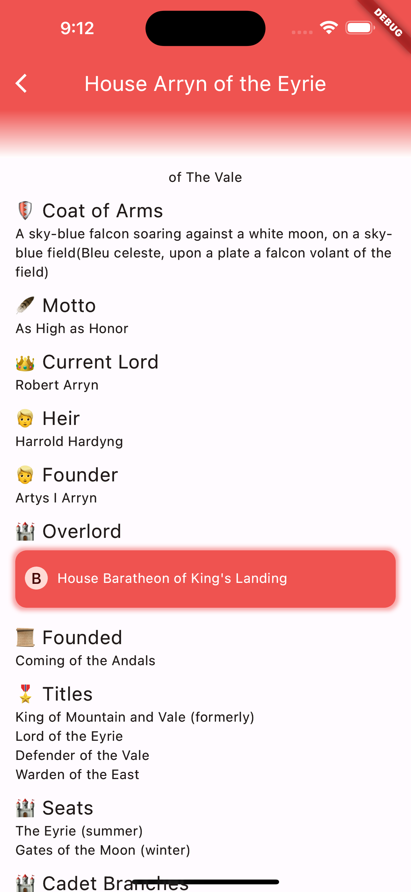
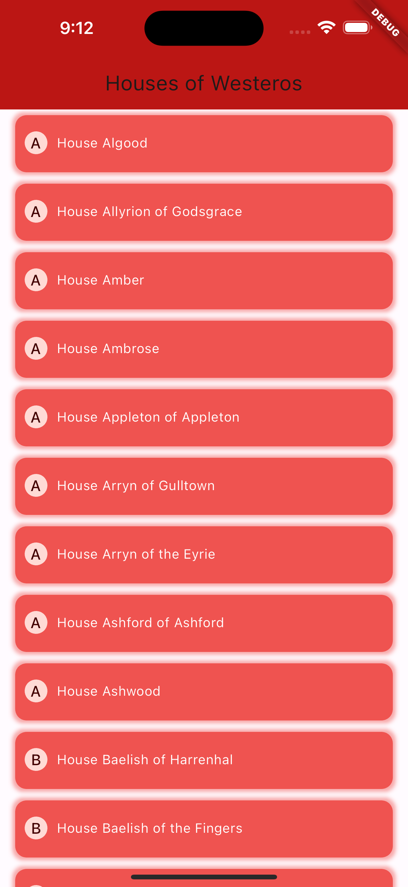

# Flutter Api Of Ice And Fire

      

A Flutter-App that lists the houses in A Song of Ice and Fire, taken from the [API of Ice And Fire](https://anapioficeandfire.com/). Also created separately [natively for iOS](https://github.com/matthiaszarzecki/SwiftUIApiOfIceAndFire/).

| _ | _ |
:-------------------------:|:-------------------------:
||

### Contains:
- Native API Calls
- Nested Calls
- Pagination
- Graceful Failure - elements that do not exist (yet) are not shown instead of showing empty elements or errors
- Detailed House-View
- List of all Houses
- Elegant in-view error-handling on SingleHouse (no popups!)
- Small Screen Support
- Continuous Integration with BitRise
- Icons on iOS
- Unit Tests
- Error Handling

### TODO:
- Icons on Android
- Improved Accessibility Features
- Character View
- Linked nested house views
- Timeouts during calls
- Error handling for faulty json parsing
- Error handling for faulty url

### Nice to Have:
- Fastlane function to create screenshots for this readme
- CodeCov integration in CICD
- Monkey-Tests
- Fetch nested data for Characters
- UI-Tests
- Dark Color Scheme & scheme switching
- Automated tests for error-handling
- Data Caching
- Welcome Tab with House of the Day View
- Info View
- Major Houses View

### See Also
[SwiftUI Api of Ice and Fire](https://github.com/matthiaszarzecki/SwiftUIApiOfIceAndFire/)

Created by Matthias Zarzecki, 2023-06
